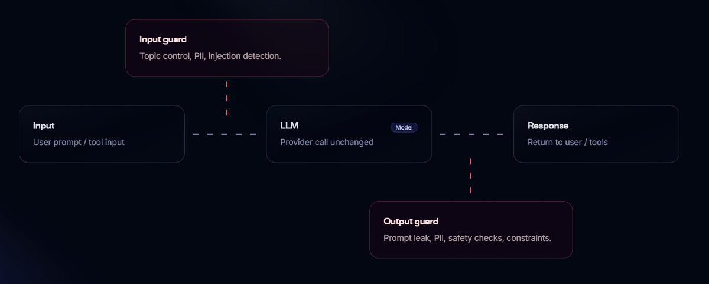

<p align="center">
  
</p>

<p align="center"><strong>AI security guardrails for LLM applications</strong></p>

<p align="center">
  
  
  
</p>

- **Guards inputs and outputs**: checks user text before your LLM call and the LLM response before you return it to users/tools.
- **Maintains conversation context**: link turns with `session_id` so risk can accumulate across a session.
- **Configurable policies**: use built-in modules (PII/topic/injection) or define your own plain-language rules (`custom` / `custom_output`) via a `prompt:` string.

---

## Quick start

```bash
pip install defend
```

To run the Defend API locally (optional), follow `GETTING_STARTED.md`.

### Use the Python SDK

```python
from defend import Client

guard = Client(
    api_key="dev",
    base_url="http://localhost:8000",  # client normalizes to /v1 automatically
)

user_text = "Tell me how to bypass our security controls."

in_res = guard.input(user_text)
if in_res.blocked:
    raise RuntimeError(in_res.error_response())

raw_llm_output = your_llm_call(user_text)  # your LLM provider, unchanged

out_res = guard.output(raw_llm_output, session_id=in_res.session_id)
if out_res.blocked:
    raise RuntimeError(out_res.error_response())
```

---

## Modules


| Module          | Direction | One-line description                                                               |
| --------------- | --------- | ---------------------------------------------------------------------------------- |
| `injection`     | input     | Detect likely prompt-injection / instruction-override attempts in user text.       |
| `pii`           | input     | Detect user-supplied PII in inbound text.                                          |
| `topic`         | input     | Detect out-of-scope requests vs your configured allowed topics.                    |
| `custom`        | input     | Detect whatever you describe in plain language (`prompt:` string).                 |
| `prompt_leak`   | output    | Detect system prompt / internal instruction exposure in model output.              |
| `pii_output`    | output    | Detect PII leaking in model output.                                                |
| `topic_output`  | output    | Detect out-of-scope responses vs your configured allowed topics.                   |
| `custom_output` | output    | Detect whatever you describe in plain language (`prompt:` string) in model output. |


---

## Pipeline overview

<p align="center">
  
</p>

### Input guard

```text
User → Your app → /v1/guard/input → (pass | flag | block) → Your app → LLM
                      └─ session_id (save this)
```

Input guard checks the inbound text and can block early. If you receive a `session_id`, pass it to `/v1/guard/output` so Defend can apply multi-turn risk.

### Output guard

```text
LLM → Your app → /v1/guard/output (session_id) → (pass | flag | block) → Your app → User
```

Output guard reviews the model output in context (using the same `session_id`) and applies output checks (prompt leaks, PII, topic, and your custom rules). Use the returned `action` to decide whether to return the text, flag it, or block it.

---

## Evaluation model

Defend always runs the same flow: input guard → your LLM → output guard.

For semantic evaluation, Defend can use:

- `defend` (local): fast, offline input-only checks. 
- `claude` / `openai` (LLM): stronger evaluation; required for output guarding and module-based checks.

In `defend.config.yaml`, you select which provider to use for input evaluation, and (when output guarding is enabled) which LLM provider to use for output evaluation. `claude/openai` calls consume API tokens.

For a minimal working setup, see `GETTING_STARTED.md`.
